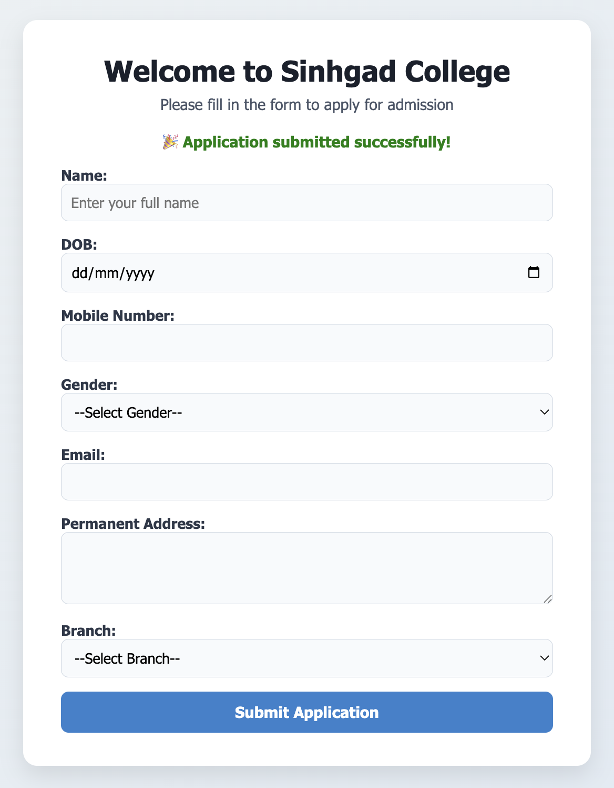

# 🎓 PHP Admission Form

A clean, responsive admission form built using **HTML**, **CSS**, **JavaScript**, and **PHP** with **MySQL database integration**. The form collects student details and stores them in a MySQL table using XAMPP. Includes real-time client-side validation and a modern, user-friendly interface.

---

## 🚀 Features

- 🧾 Collects student details: name, DOB, contact, email, gender, address, branch
- 📬 Stores data in MySQL table `admission`
- ✅ JavaScript validation (name, email, phone)
- 💻 Responsive and elegant UI (mobile-friendly)
- 🛠 Works with XAMPP (localhost setup)

---

## 🛠 Technologies Used

- HTML, CSS, JavaScript
- PHP
- MySQL (phpMyAdmin)
- XAMPP (Apache & MySQL server)

---

## 💡 How to Run

1. Clone the repo or download ZIP
2. Place the project in `htdocs/` folder inside XAMPP
3. Start **Apache** and **MySQL** from XAMPP
4. Create database:
    ```sql
    CREATE DATABASE Admission;
    USE Admission;
    CREATE TABLE admission (
      id INT AUTO_INCREMENT PRIMARY KEY,
      name VARCHAR(100),
      dob DATE,
      phone VARCHAR(10),
      gender VARCHAR(10),
      email VARCHAR(100),
      address TEXT,
      branch VARCHAR(50),
      dt TIMESTAMP DEFAULT CURRENT_TIMESTAMP
    );
    ```
5. Open in browser:  
   `http://localhost/php-admission-form/index.php`

---

## 📸 Screenshot




## 🙋 Author

Gunwant Patil  
[GitHub](https://github.com/gunwant29)


